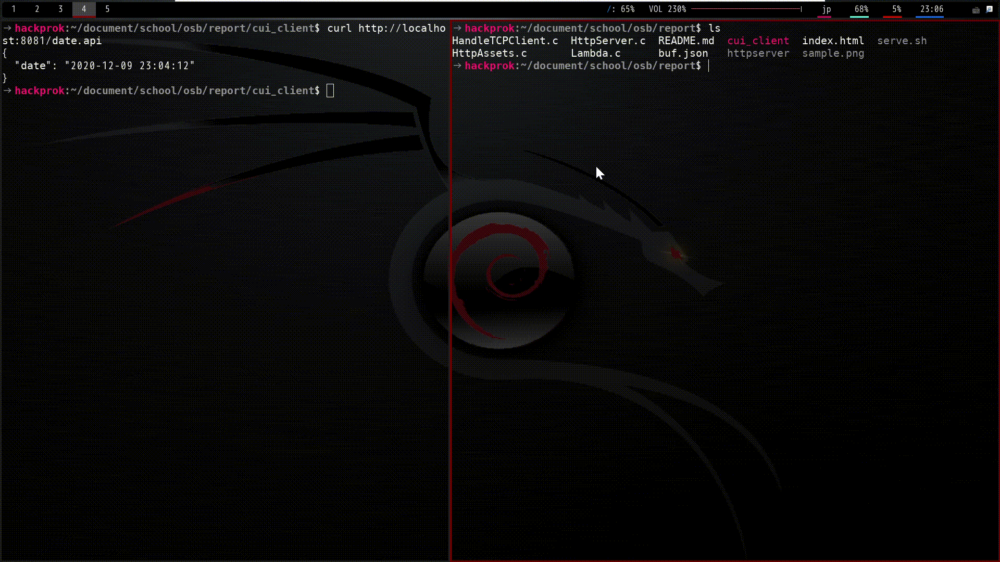

# C HTTP Server

## what is this?
This is a Simple HTTP Server program (and client) written in C.  
Notice that this program is just made for educational purpose and not for the regular use.  

 

## how to use?
just follow the steps below.  
-	`git clone https://github.com/KazuMatsuHack9981/C_HttpServer.git`
-	`chmod +x serve.sh` maybe `sudo` is required for this
-	run server by `./serve.sh`
-	open your browser and access "http://localhost:8081/"  

Default port used in this server is "8081" but you can  
change it by modifing `./serve.sh`.

 

## implemented feature
- GET request for static html page
- GET request for API call
- GET request with querystrings
- redirection
